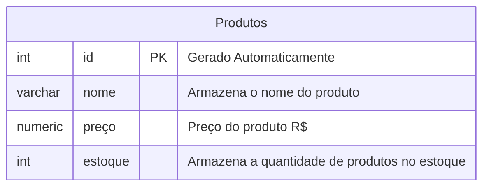
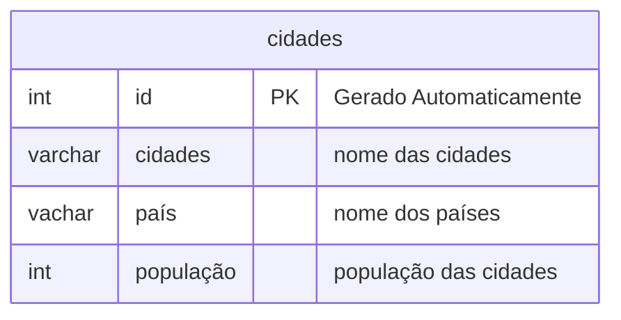

## Aula 04
Alteração de parâmetros de configuração:

![alt]


Para excluir um banco de dados, utilizamos o comando:

```sql
DROP DATABASE cidades,
```
>Cuidado na operação

Primeiro, iniciamos o processo criando um novo banco de dados:
```sql
CREATE DATABASE loja;
```
---
**Modelando o primeiro banco de dados**


Para criação do bancos de de dados, utilizamos os seguintes comandos:

```sql
CREATE TABLE produtos(
     id INT GENERATED ALWAYS AS IDENTITY PRIMARY KEY NOT NULL,
     nome VARCHAR(50) NOT NULL,
     preço NUMERIC(10,2) NOT NULL,
     estoque INT NOT NULL DEFAULT 0
);
```

Para consultar todos os dados da tabela:
```sql
SELECT * FROM produtos;
```
Para incerir na table precisa desse comando:
```sql
INSERT INTO produtos(nome,preço,estoque)
VALUES('Chuveiro','100','20');
```

INSERT INTO cidades_ricas(nome,pais,populacao)
VALUES('Nova York', 'Estados Unidos', '8200000');
