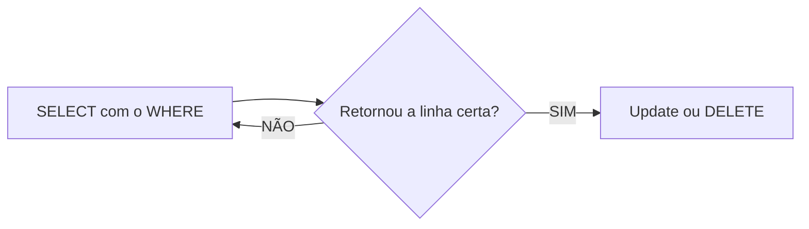
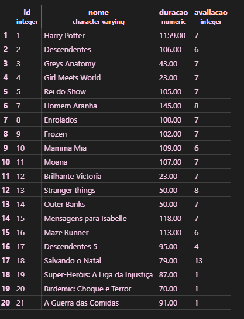
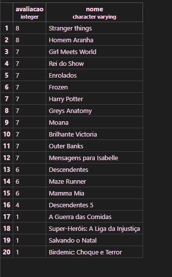
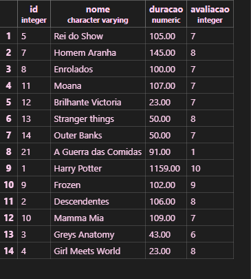
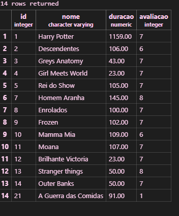

## Update e Delete
**UPDATE** ou **DELETE** afetam todas as linhas da sua tabela. Logo, **JAMIAS** executar sem o comando `WHERE`.

UPDATE filmes
SET avaliacao=10
WHERE nome='Tropa de Elite';
```

```mermaid
erDiagram
streming {
    int id PK "Gerado Automaticamente"
    varchar nome "Nome do filme ou série"
    int duracao "Duração do filme ou série (min)"
    int avaliacao "avaliacao de 0-10"
}

```sql
CREATE TABLE produtos(
     id INT GENERATED ALWAYS AS IDENTITY PRIMARY KEY NOT NULL,
     nome VARCHAR(100) NOT NULL,
     duracao INT(10,2) NOT NULL,
     avaliacao INT NOT NULL DEFAULT 0
);
```

### explicação da atividade:
-Eu fiz a tabela Streming com vinte filmes e séries: 

-Depois coloquei em ordem creçente os melhores filmes e séries: 

- Essa é a tabela atualizada 

- Depois retirei cinco 