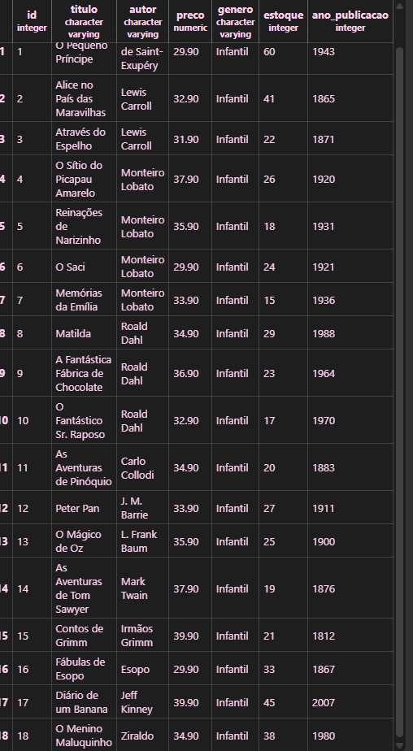
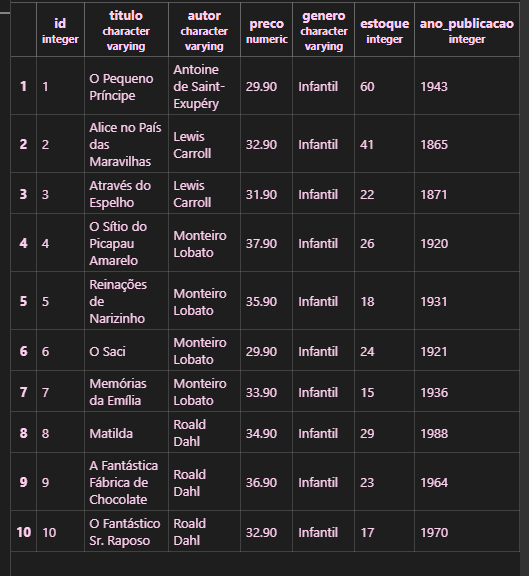
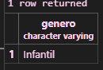
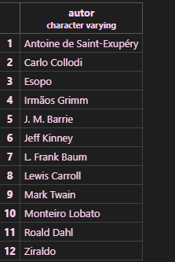
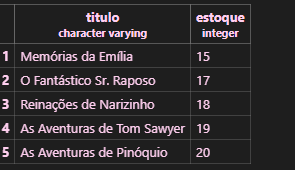
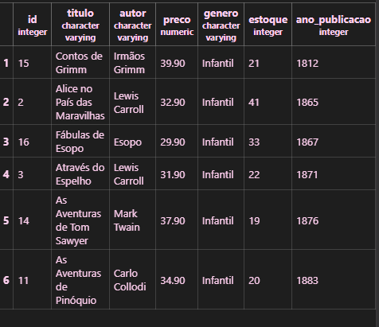

DROP DATABASE-apaga o banco de dados dentro do postgres
DROP DATABASE IF EXISTS- para caso ainda exista

CREATE DATABASE- para criar um banco de dados dentro do postgres

Crianção da tabela de kabum

```SQL
CREATE TABLE produtos(
    id SERIAL PRIMARY KEY,
    nome VARCHAR(100) NOT NULL,
    categoria VARCHAR(50) NOT NULL,
    preco DECIMAL (10,2) NOT NULL,
    estoque INTEGER NOT NULL
);
```
 
Inserido os dados:

INSERT INTO produtos (nome, categoria, preco, estoque) VALUES
('Mouse Óptico USB', 'Periféricos', 50.00, 120),
('Mouse Sem Fio', 'Periféricos', 89.90, 85),
('Mouse Gamer RGB', 'Periféricos', 249.00, 32),
('Teclado ABNT2 USB', 'Periféricos', 120.00, 64),
('Teclado Mecânico Gamer', 'Periféricos', 459.00, 18),
('Teclado Sem Fio Slim', 'Periféricos', 199.00, 40),
('Mousepad Grande', 'Periféricos', 45.00, 150),
('Suporte Ergonômico Notebook', 'Periféricos', 135.00, 28),
('Hub USB 4 Portas', 'Periféricos', 79.00, 95),
('Adaptador USB-C HDMI', 'Periféricos', 159.00, 47),

('Monitor 21,5 Full HD', 'Monitores', 750.00, 22),
('Monitor 24 Full HD IPS', 'Monitores', 950.00, 19),
('Monitor 27 QHD', 'Monitores', 1890.00, 8),
('Monitor 32 4K', 'Monitores', 2790.00, 4),
('Monitor Gamer 144Hz', 'Monitores', 1650.00, 11),
('Suporte Articulado Monitor', 'Monitores', 289.00, 26),

('Notebook Básico 8GB', 'Notebooks', 2890.00, 14),
('Notebook Intermediário 16GB', 'Notebooks', 4500.00, 9),
('Notebook Gamer RTX', 'Notebooks', 7990.00, 3),
('Notebook Ultrafino 14', 'Notebooks', 5300.00, 6),
('Chromebook 11', 'Notebooks', 1790.00, 17),
('Carregador Universal 65W', 'Notebooks', 189.00, 58),

('Impressora Laser Mono', 'Impressão', 800.00, 12),
('Impressora Multifuncional', 'Impressão', 1250.00, 7),
('Impressora Tanque de Tinta', 'Impressão', 1090.00, 10),
('Toner Compatível Preto', 'Impressão', 145.00, 72),
('Cartucho Colorido', 'Impressão', 98.00, 88),
('Papel A4 500 folhas', 'Impressão', 29.90, 240),
('Scanner de Mesa', 'Impressão', 690.00, 5),

('Roteador Wi-Fi 5 Dual Band', 'Redes', 249.00, 35),
('Roteador Wi-Fi 6 AX1500', 'Redes', 459.00, 16),
('Switch 8 Portas Gigabit', 'Redes', 329.00, 21),
('Cabo de Rede Cat6 5m', 'Redes', 35.00, 180),
('Repetidor de Sinal Wi-Fi', 'Redes', 139.00, 54),
('Placa de Rede USB Wi-Fi', 'Redes', 89.00, 66),
('Nobreak 1500VA', 'Redes', 980.00, 6),

('SSD 480GB SATA', 'Armazenamento', 289.00, 45),
('SSD 1TB NVMe', 'Armazenamento', 549.00, 24),
('SSD 2TB NVMe', 'Armazenamento',1090.00, 9),
('HD Externo 1TB', 'Armazenamento', 379.00, 31),
('HD Externo 2TB', 'Armazenamento', 549.00, 15),
('Pen Drive 64GB', 'Armazenamento', 49.90, 200),
('Pen Drive 128GB', 'Armazenamento', 79.90, 110),
('Cartão de Memória 128GB', 'Armazenamento', 99.00, 76),

('Headset Gamer com Microfone', 'Áudio', 250.00, 38),
('Headset Bluetooth', 'Áudio', 329.00, 27),
('Caixa de Som Bluetooth', 'Áudio', 189.00, 49),
('Fone Intra-Auricular', 'Áudio', 69.90, 130),
('Microfone Condensador USB', 'Áudio', 449.00, 13),
('Webcam Full HD 1080p', 'Áudio', 180.00, 41);

```sql
SELECT nome,preco FROM produtos;
```

*-mostra todos os produtos

Conragem de registros:
```SQL
SELECT COUNT(*) FROM produtos;
```
Serve para limitar até a quantidade que vc queira
```SQL
SELECT * FROM produtos LIMIT 5;
```
Para categoria do produtos:
```SQL
SELECT DISTINCT categoria FROM produtos; 
```

Para ser em ordem alfabetica:
```SQL
SELECT DISTINCT categoria FROM produtos ORDER BY categoria; 
```

Filtro por categorias:
```SQL
SELECT nome,preco
FROM produtos
WHERE categoria='Áudio';
```

Para por o valor que vc pode pagar:
```SQL
SELECT nome,preco
From produtos
WHERE preco <= 500;
```

Filtro de faixas:
```SQL
SELECT nome,preco
FROM produtos
WHERE preco BETWEEN 100 AND 1000;
```
Ou pode ser assim:
```SQL
SELECT nome,preco
FROM produtos
WHERE preco >= 100 AND  preco <= 1000;
```

Oredem do menor ao maior:
```SQL
SELECT nome,preco
FROM produtos
ORDER BY preco;
```

Ordem do maior para o menor:
```SQL
SELECT nome,preco
FROM produtos
ORDER BY preco DESC;
```

## Atividade criar uma tabela em uma biblioteca

Bloco 1
Criei a tabela:
```SQL
CREATE TABLE livros(
    id SERIAL PRIMARY KEY,
    titulo VARCHAR(100) NOT NULL,
    autor VARCHAR(100) NOT NULL,
    preco DECIMAL (10,2) NOT NULL,
    genero VARCHAR (100) NOT NULL,
    estoque INTEGER NOT NULL,
    ano_publicacao INTEGER NOT NULL
);
```
 
 Depois peguei e coloquei os livros infantis na tabela:
 INSERT INTO livros (titulo, autor, preco, genero, estoque, ano_publicacao) VALUES
('O Pequeno Príncipe',                        'Antoine de Saint-Exupéry',   29.90, 'Infantil',           60, 1943),
('Alice no País das Maravilhas',              'Lewis Carroll',              32.90, 'Infantil',           41, 1865),
('Através do Espelho',                        'Lewis Carroll',              31.90, 'Infantil',           22, 1871),
('O Sítio do Picapau Amarelo',                'Monteiro Lobato',            37.90, 'Infantil',           26, 1920),
('Reinações de Narizinho',                    'Monteiro Lobato',            35.90, 'Infantil',           18, 1931),
('O Saci',                                    'Monteiro Lobato',            29.90, 'Infantil',           24, 1921),
('Memórias da Emília',                        'Monteiro Lobato',            33.90, 'Infantil',           15, 1936),
('Matilda',                                   'Roald Dahl',                 34.90, 'Infantil',           29, 1988),
('A Fantástica Fábrica de Chocolate',         'Roald Dahl',                 36.90, 'Infantil',           23, 1964),
('O Fantástico Sr. Raposo',                   'Roald Dahl',                 32.90, 'Infantil',           17, 1970),
('As Aventuras de Pinóquio',                  'Carlo Collodi',              34.90, 'Infantil',           20, 1883),
('Peter Pan',                                 'J. M. Barrie',               33.90, 'Infantil',           27, 1911),
('O Mágico de Oz',                            'L. Frank Baum',              35.90, 'Infantil',           25, 1900),
('As Aventuras de Tom Sawyer',                'Mark Twain',                 37.90, 'Infantil',           19, 1876),
('Contos de Grimm',                           'Irmãos Grimm',               39.90, 'Infantil',           21, 1812),
('Fábulas de Esopo',                          'Esopo',                      29.90, 'Infantil',           33, 1867),
('Diário de um Banana',                       'Jeff Kinney',                39.90, 'Infantil',           45, 2007),
('O Menino Maluquinho',                       'Ziraldo',                    34.90, 'Infantil',           38, 1980);

ficou assim 

- Depois coloquei para limitar até 10:


- Depois coloquei para aparecer só  titulo, autor e preco de todos os livros.

- Odernei os generos em ordem alfabética:

- fiz para aparecer quanto autores tem na tabela: 

- Fiz a lista de 5 livros mais caro 

- Depois fiz com o 5 livros com menor estoque: 

Bloco2
- Fiz tabela só com livros infantis

- não tem livros com preços que custam mais que R$200,00

- Não tem livros acima de R$40,00

- não tem livro com estoque abaixo de 5 

-Livros publicados antes dos anos 1900:

- Não tem livros que é entre 2010 a 2020: o unico que tem mais novo é de 2007