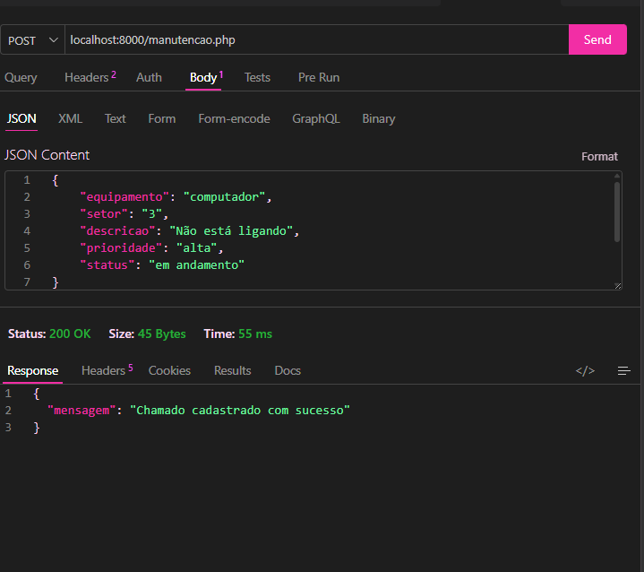
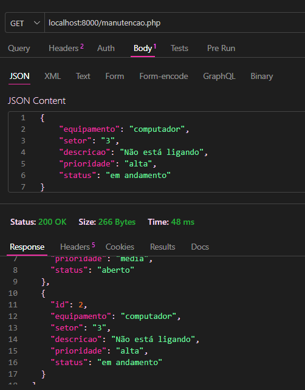
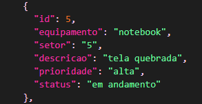
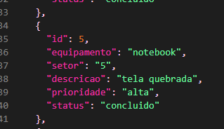
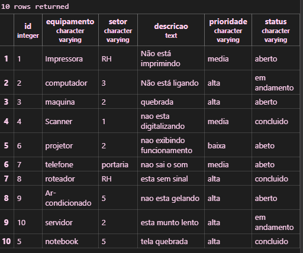
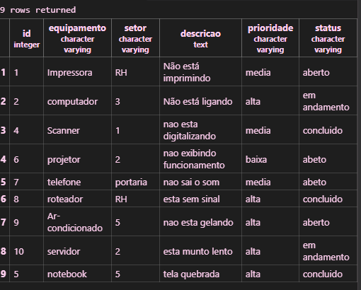

## primeiro eu criei a tabela:
CREATE TABLE chamados( 
    id INT GENERATED ALWAYS AS IDENTITY PRIMARY KEY, 
    equipamento VARCHAR(100) NOT NULL, 
    setor VARCHAR(100) NOT NULL, 
    descricao TEXT NOT NULL,
    prioridade VARCHAR(20) NOT NULL, 
    status VARCHAR(20) NOT NULL 
);

## Depois ajuste em manutencao.php e conexao.php

## depois coloquei os produtus em Json:

## Depois em GET:

## Antes do PUT:

## Depois do PUT:

## Antes do DELETE:

## Depois do DELETE:
