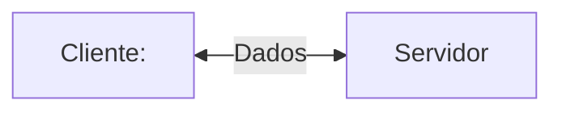
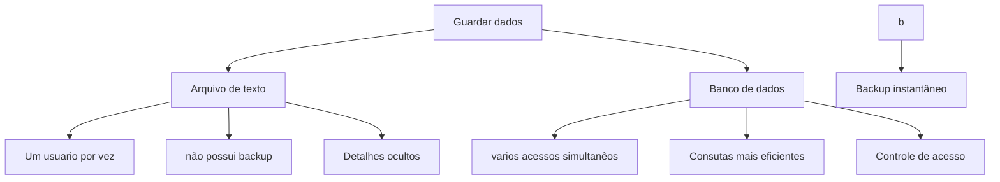
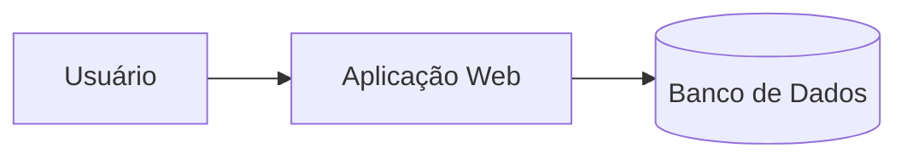
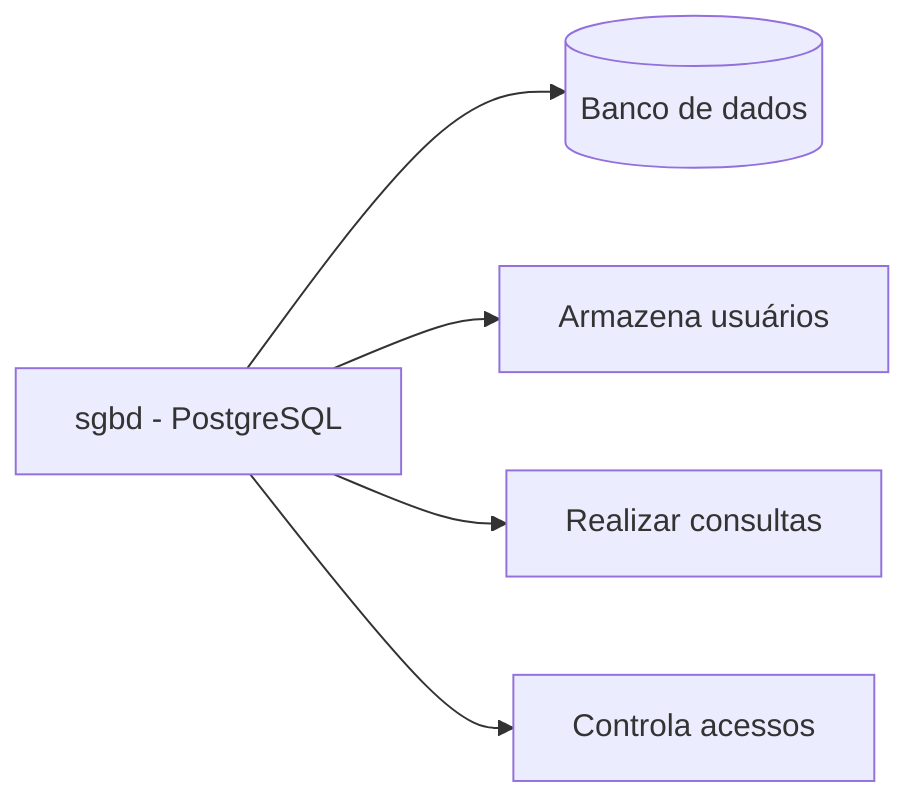

## Servidor de Desenvolvimento
Será uma interface de desenvolvimento, utilizada para projetar aplicações e banco de dados.


---
## Servidor de Arquivos Educacional
É um servidor para armazenar arquivos e facilitar na hora de realizar a transferência.

>O endereço para acesso ao servidor de arquivos é: `\\10.87.36.10`.
>Creenciais de acesso: `E-mail aluno, senha: aluno`


---
## Servidor Pessoal
O Moba será a interface para acesso ao meu sevidor de desenvolvimento.
>O acesso, será realizado vis SSH.
>O acesso do meu servidor pessoal: `IP:192.168.10.90`. username: `root`e Porta: `2222`.

Para o primeiro acesso, utilizamos a senha: `alunos01`.
Para alterar a senha, utilizamos o comando:

```bash
passwd
```
Para visualizar os recursos do sevidor linux usamos o comando:`htop`
```
```
---
|Recurso| Configuração|
|----|-------|
|Processador|2 cores|
|RAM|512MB|
|Armazenamento|6 GB|
|Sistema Operacional|Ubunto 26.04 LTS|
---
A utilização de um sevidor de desenvolvimento, simula um ambiente real de prudução os objetivos  esperados são:

-
Deploy de projetos,
- Aplicação de banco de dados,
- Experiência real de mercado

## Banco de dados
Antigamente, os dados eram salvos em arquivos/planilhas.


---
>Mas afinal, onde entra o banco de dados em aplicação web?

```

```

---
```
## SGBD
Sistema Gerenciador de Banco de Dados.
```
>Função: Gerenciar, controlar e permitir consultar consultas nos nossos bancos de dados.
```
```

---